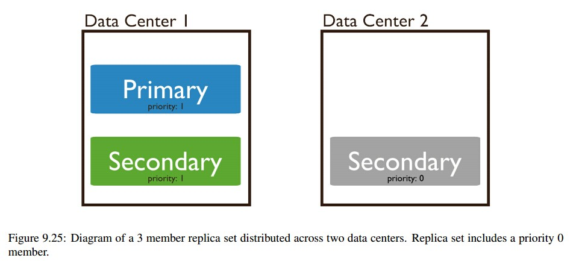

在[搭建mongodb集群实例](https://github.com/lijieyuannlp/mongo-notes/blob/master/%E6%9E%84%E5%BB%BAmongodb%E9%9B%86%E7%BE%A4%E5%AE%9E%E4%BE%8B.md)一文中,我们给出了mongo集群管理的一些常用方法和操作，那些是集群管理的基础，本文作为集群管理的进阶指南。

mongodb副本集的管理以下方面：

- 初始化部署
- 添加节点
- 删除节点
- 配置集合的参数和属性

##在多台机器上部署mongodb副本集##
>如果将mongo副本集部署在一台机器或者一个数据中心，那么如果发生断电，网络中断等故障，那么整个副本集都挂了，如果部署到多台机器或者多个数据中心，可进一步增加mongo的鲁棒性。

对于三个成员的副本集，可以将两个节点部署到A站点，一个节点部署到B站点。A站点应该和应用的基础设施（应用的服务程序，缓存系统等）同属一个设备。

对于四个成员的副本集，A站点至少具有两个节点，并且其中一个为仲裁节点(不接受数据同步，只具有选举权)。

###三成员结构部署

目标
>在站点A部署两个节点，这两个节点的优先级比较高，主节点从这两个节点选出。站点B部署一个节点，优先级设置为0，只是起到备份数据的作用。

- 在站点A建立两个数据文件目录和一个log文件目录
<pre>
mkdir -p /data/data/node1 /data/data/node2 /data/log
</pre>

- 在站点A启动2个实例，集群取名，loggod
<pre>
sudo ./mongod -replSet loggod --port 10001 --smallfiles --dbpath /data/data/node1 --logpath /data/log/node1.log --logappend --fork
sudo ./mongod -replSet loggod --port 10002 --smallfiles --dbpath /data/data/node2 --logpath /data/log/node2.log --logappend --fork
</pre>

- 在站点B创建数据文件目录和log文件目录
<pre>
sudo mkdir -p /data/data/node3 /data/log
</pre>

- 在站点B启动mongo实例，集群名字为loggod
<pre>
sudo ./mongod -replSet loggod --fork --port 10003 --smallfiles --dbpath /data/data/node3 --logpath /data/log/node3.log --logappend
</pre>

- 配置，客户端连接站点A的10001端口的node1节点，配置前请检查主机的联通性(查看[linux通过主机名进行通信](https://github.com/lijieyuannlp/Shell-Peals/blob/master/%E9%80%9A%E8%BF%87linux%E4%B8%BB%E6%9C%BA%E5%90%8D%E8%AE%BF%E9%97%AE%E5%85%B6%E4%BB%96%E4%B8%BB%E6%9C%BA.md))
<pre>
 sudo ./mongo --port 10001
MongoDB shell version: 2.6.3
connecting to: 127.0.0.1:10001/test
rs.initiate()//初始化
{
        "info2" : "no configuration explicitly specified -- making one",
        "me" : "ubuntu-dialog:10001",
        "info" : "Config now saved locally.  Should come online in about a minute.",
        "ok" : 1
}
loggod:OTHER> rs.conf()//查看配置
{
        "_id" : "loggod",
        "version" : 1,
        "members" : [
                {
                  "_id" : 0,
                  "host" : "ubuntu-dialog:10001"
                }
        ]
}
loggod:PRIMARY> rs.status()//当前集群状态
{
        "set" : "loggod",
        "date" : ISODate("2014-09-02T08:59:05Z"),
        "myState" : 1,
        "members" : [
                {
                  "_id" : 0,
                  "name" : "ubuntu-dialog:10001",
                  "health" : 1,
                  "state" : 1,
                  "stateStr" : "PRIMARY",
                  "uptime" : 149,
                  "optime" : Timestamp(1409648336, 1),
                  "optimeDate" : ISODate("2014-09-02T08:58:56Z"),
                  "electionTime" : Timestamp(1409648336, 2),
                  "electionDate" : ISODate("2014-09-02T08:58:56Z"),
                  "self" : true
                }
        ],
        "ok" : 1
}
loggod:PRIMARY> rs.add("ubuntu-dialog:10002")//增加站点A的node2
{ "ok" : 1 }
loggod:PRIMARY> rs.add("ubuntu-12:10003")//增加站点B的node3
{ "ok" : 1 }
</pre>
<pre>
loggod:PRIMARY> rs.status()//当前状态
{
        "set" : "loggod",
        "date" : ISODate("2014-09-02T09:00:25Z"),
        "myState" : 1,
        "members" : [
                {
                  "_id" : 0,
                  "name" : "ubuntu-dialog:10001",
                  "health" : 1,
                  "state" : 1,
                  "stateStr" : "PRIMARY",
                  "uptime" : 229,
                  "optime" : Timestamp(1409648389, 1),
                  "optimeDate" : ISODate("2014-09-02T08:59:49Z"),
                  "electionTime" : Timestamp(1409648336, 2),
                  "electionDate" : ISODate("2014-09-02T08:58:56Z"),
                  "self" : true
                },
                {
                  "_id" : 1,
                  "name" : "ubuntu-dialog:10002",
                  "health" : 1,
                  "state" : 2,
                  "stateStr" : "SECONDARY",
                  "uptime" : 60,
                  "optime" : Timestamp(1409648389, 1),
                  "optimeDate" : ISODate("2014-09-02T08:59:49Z"),
                  "lastHeartbeat" : ISODate("2014-09-02T09:00:23Z"),
                  "lastHeartbeatRecv" : ISODate("2014-09-02T09:00:23Z"),
                  "pingMs" : 0,
                  "syncingTo" : "ubuntu-dialog:10001"
                },
                {
                  "_id" : 2,
                  "name" : "ubuntu-12:10003",
                  "health" : 1,
                  "state" : 2,
                  "stateStr" : "SECONDARY",
                  "uptime" : 36,
                  "optime" : Timestamp(1409648389, 1),
                  "optimeDate" : ISODate("2014-09-02T08:59:49Z"),
                  "lastHeartbeat" : ISODate("2014-09-02T09:00:25Z"),
                  "lastHeartbeatRecv" : ISODate("2014-09-02T09:00:23Z"),
                  "pingMs" : 0,
                  "syncingTo" : "ubuntu-dialog:10001"
                }
        ],
        "ok" : 1
}
</pre>

- 将站点B的node3的优先级设置为0，即该节点只作为备份节点使用，不作为主节点使用

<pre>
loggod:PRIMARY> cfg=rs.conf()
{
        "_id" : "loggod",
        "version" : 3,
        "members" : [
                {
                  "_id" : 0,
                  "host" : "ubuntu-dialog:10001"
                },
                {
                  "_id" : 1,
                  "host" : "ubuntu-dialog:10002"
                },
                {
                  "_id" : 2,
                  "host" : "ubuntu-12:10003"
                }
        ]
}
loggod:PRIMARY> cfg.members[2].priority=0//2，members数组从0开始计数，2对应node3
0
loggod:PRIMARY> rs.reconfig(cfg)
2014-09-02T17:06:30.010+0800 DBClientCursor::init call() failed
2014-09-02T17:06:30.012+0800 trying reconnect to 127.0.0.1:10001 (127.0.0.1) failed
2014-09-02T17:06:30.012+0800 reconnect 127.0.0.1:10001 (127.0.0.1) ok
reconnected to server after rs command (which is normal)
</pre>

- over。。。

###4成员部署

4成员需要考虑点有如下：

- 一个节点作为仲裁者(arbiter)
- 集群有三种构建方案：
	- 站点A有3个成员，站点B有1个成员（优先级为0），仲裁者添加到站点A
	- 站点A有2个成员，站点B有2个成员（优先级为0），仲裁者添加到站点A
	- 站点A有2个成员，站点B有1个成员（优先级为0），站点C有一个成员（优先级为0），仲裁者添加到站点A

为毛要有上述设计呢？

>遵循"少数服从多数的原则"。mongodb的集群很民主，实现选举决定主节点。4个节点，理论上可能出现2VS2的平局局面，所以加入一个只有选举权的，并且没有数据同步功能的仲裁者，这样肯定能选举出主节点。另外，就是将主节点部署在大多数节点的站点，因此选择站点A。

- 假设，已经按照上述3节点的配置，完成了3节点集群的搭建
- 首先，在站点A增加节点node4
<pre>
sudo ./mongod -replSet loggod --port 10004 --smallfiles --dbpath /data/data/node4 --logpath /data/log/node4.log --logappend --fork
</pre>

- 配置节点node4
<pre>
loggod:PRIMARY> rs.add('ubuntu-dialog:10004')
{ "ok" : 1 }
loggod:PRIMARY> rs.status()//查看集群状态
{
        "set" : "loggod",
        "date" : ISODate("2014-09-02T09:30:57Z"),
        "myState" : 1,
        "members" : [
                {
                  "_id" : 0,
                  "name" : "ubuntu-dialog:10001",
                  "health" : 1,
                  "state" : 1,
                  "stateStr" : "PRIMARY",
                  "uptime" : 2061,
                  "optime" : Timestamp(1409650236, 1),
                  "optimeDate" : ISODate("2014-09-02T09:30:36Z"),
                  "electionTime" : Timestamp(1409648336, 2),
                  "electionDate" : ISODate("2014-09-02T08:58:56Z"),
                  "self" : true
                },
                {
                  "_id" : 1,
                  "name" : "ubuntu-dialog:10002",
                  "health" : 1,
                  "state" : 2,
                  "stateStr" : "SECONDARY",
                  "uptime" : 1468,
                  "optime" : Timestamp(1409650236, 1),
                  "optimeDate" : ISODate("2014-09-02T09:30:36Z"),
                  "lastHeartbeat" : ISODate("2014-09-02T09:30:56Z"),
                  "lastHeartbeatRecv" : ISODate("2014-09-02T09:30:56Z"),
                  "pingMs" : 0,
                  "syncingTo" : "ubuntu-dialog:10001"
                },
                {
                  "_id" : 2,
                  "name" : "ubuntu-12:10003",
                  "health" : 1,
                  "state" : 2,
                  "stateStr" : "SECONDARY",
                  "uptime" : 1468,
                  "optime" : Timestamp(1409650236, 1),
                  "optimeDate" : ISODate("2014-09-02T09:30:36Z"),
                  "lastHeartbeat" : ISODate("2014-09-02T09:30:56Z"),
                  "lastHeartbeatRecv" : ISODate("2014-09-02T09:30:56Z"),
                  "pingMs" : 0,
                  "syncingTo" : "ubuntu-dialog:10001"
                },
                {
                  "_id" : 3,
                  "name" : "ubuntu-dialog:10004",
                  "health" : 1,
                  "state" : 3,
                  "stateStr" : "RECOVERING",
                  "uptime" : 21,
                  "optime" : Timestamp(1409650236, 1),
                  "optimeDate" : ISODate("2014-09-02T09:30:36Z"),
                  "lastHeartbeat" : ISODate("2014-09-02T09:30:56Z"),
                  "lastHeartbeatRecv" : ISODate("2014-09-02T09:30:57Z"),
                  "pingMs" : 0,
                  "lastHeartbeatMessage" : "initial sync done",
                  "syncingTo" : "ubuntu-dialog:10001"
                }
        ],
        "ok" : 1
}
</pre>

- 增加一个仲裁者

仲裁者是一个mongo实例，并且也是mongo集群的一个成员，但是他不包含数据。如果有偶数个成员时，需要增加一个仲裁者。仲裁者只需很少的硬件资源。
<pre>
创建数据目录
mkdir -p /data/data/arb

mongod --fork --port 10005 --dbpath /data/data/arb --logpath /data/log/arb.log --replSet loggod --smallfiles --noprealloc --nojournal

//连接主节点
sudo ./mongo --port 10001
MongoDB shell version: 2.6.4
connecting to: 127.0.0.1:10001/test

//当前集群的配置
loggod:PRIMARY> rs.conf()
{
        "_id" : "loggod",
        "version" : 5,
        "members" : [
                {
                  "_id" : 0,
                  "host" : "ubuntu-dialog:10001"
                },
                {
                  "_id" : 1,
                  "host" : "ubuntu-dialog:10002"
                },
                {
                  "_id" : 2,
                  "host" : "ubuntu-12:10003",
                  "priority" : 0
                },
                {
                  "_id" : 3,
                  "host" : "ubuntu-dialog:10004"
                }
        ]
}
//增加仲裁者
loggod:PRIMARY> rs.addArb('ubuntu-dialog:10005')
{ "ok" : 1 }

//当前状态
loggod:PRIMARY> rs.status()
{
        "set" : "loggod",
        "date" : ISODate("2014-09-02T09:47:27Z"),
        "myState" : 1,
        "members" : [
                {
                  "_id" : 0,
                  "name" : "ubuntu-dialog:10001",
                  "health" : 1,
                  "state" : 1,
                  "stateStr" : "PRIMARY",
                  "uptime" : 3051,
                  "optime" : Timestamp(1409651229, 1),
                  "optimeDate" : ISODate("2014-09-02T09:47:09Z"),
                  "electionTime" : Timestamp(1409648336, 2),
                  "electionDate" : ISODate("2014-09-02T08:58:56Z"),
                  "self" : true
                },
                {
                  "_id" : 1,
                  "name" : "ubuntu-dialog:10002",
                  "health" : 1,
                  "state" : 2,
                  "stateStr" : "SECONDARY",
                  "uptime" : 2458,
                  "optime" : Timestamp(1409651229, 1),
                  "optimeDate" : ISODate("2014-09-02T09:47:09Z"),
                  "lastHeartbeat" : ISODate("2014-09-02T09:47:26Z"),
                  "lastHeartbeatRecv" : ISODate("2014-09-02T09:47:26Z"),
                  "pingMs" : 0,
                  "syncingTo" : "ubuntu-dialog:10001"
                },
                {
                  "_id" : 2,
                  "name" : "ubuntu-12:10003",
                  "health" : 1,
                  "state" : 2,
                  "stateStr" : "SECONDARY",
                  "uptime" : 2458,
                  "optime" : Timestamp(1409651229, 1),
                  "optimeDate" : ISODate("2014-09-02T09:47:09Z"),
                  "lastHeartbeat" : ISODate("2014-09-02T09:47:27Z"),
                  "lastHeartbeatRecv" : ISODate("2014-09-02T09:47:26Z"),
                  "pingMs" : 0,
                  "syncingTo" : "ubuntu-dialog:10001"
                },
                {
                  "_id" : 3,
                  "name" : "ubuntu-dialog:10004",
                  "health" : 1,
                  "state" : 2,
                  "stateStr" : "SECONDARY",
                  "uptime" : 1011,
                  "optime" : Timestamp(1409651229, 1),
                  "optimeDate" : ISODate("2014-09-02T09:47:09Z"),
                  "lastHeartbeat" : ISODate("2014-09-02T09:47:27Z"),
                  "lastHeartbeatRecv" : ISODate("2014-09-02T09:47:25Z"),
                  "pingMs" : 0,
                  "syncingTo" : "ubuntu-dialog:10001"
                },
                {
                  "_id" : 4,
                  "name" : "ubuntu-dialog:10005",
                  "health" : 1,
                  "state" : 7,
                  "stateStr" : "ARBITER",//状态为仲裁者
                  "uptime" : 18,
                  "lastHeartbeat" : ISODate("2014-09-02T09:47:25Z"),
                  "lastHeartbeatRecv" : ISODate("2014-09-02T09:47:26Z"),
                  "pingMs" : 0
                }
        ],
        "ok" : 1
}
loggod:PRIMARY> 

</pre>

- over。。4节点部署完成。配送一个仲裁者节点。

##集群成员配置

###优先级调整

通过设置优先级，使优先级高的节点成为主节点的可能性变大，优先级为0的节点不能成为主节点，从而操控选举（现实世界也是如此，没有绝对的民主！）。

优先级的值从0到1000不等，默认的优先级为1。隐节点(Hidden)，延迟节点（delayed），仲裁者的优先级都是0。优先级的调整是实时的，如果当前系统中有优先级高于当前主节点的从节点，那么主节点立马变身从节点，优先级高的从节点摇身一变成为主节点。

<pre>
 sudo ./mongo --port 10001
[sudo] password for dialog: 
MongoDB shell version: 2.6.4
connecting to: 127.0.0.1:10001/test
loggod:PRIMARY> rs.status()//当前主节点为Node1
{
        "set" : "loggod",
        "date" : ISODate("2014-09-02T10:07:05Z"),
        "myState" : 1,
        "members" : [
                {
                  "_id" : 0,
                  "name" : "ubuntu-dialog:10001",
                  "health" : 1,
                  "state" : 1,
                  "stateStr" : "PRIMARY",
                  "uptime" : 4229,
                  "optime" : Timestamp(1409651229, 1),
                  "optimeDate" : ISODate("2014-09-02T09:47:09Z"),
                  "electionTime" : Timestamp(1409648336, 2),
                  "electionDate" : ISODate("2014-09-02T08:58:56Z"),
                  "self" : true
                },
                {
                  "_id" : 1,
                  "name" : "ubuntu-dialog:10002",
                  "health" : 1,
                  "state" : 2,
                  "stateStr" : "SECONDARY",
                  "uptime" : 3636,
                  "optime" : Timestamp(1409651229, 1),
                  "optimeDate" : ISODate("2014-09-02T09:47:09Z"),
                  "lastHeartbeat" : ISODate("2014-09-02T10:07:04Z"),
                  "lastHeartbeatRecv" : ISODate("2014-09-02T10:07:04Z"),
                  "pingMs" : 0,
                  "syncingTo" : "ubuntu-dialog:10001"
                },
                {
                  "_id" : 2,
                  "name" : "ubuntu-12:10003",
                  "health" : 1,
                  "state" : 2,
                  "stateStr" : "SECONDARY",
                  "uptime" : 3636,
                  "optime" : Timestamp(1409651229, 1),
                  "optimeDate" : ISODate("2014-09-02T09:47:09Z"),
                  "lastHeartbeat" : ISODate("2014-09-02T10:07:03Z"),
                  "lastHeartbeatRecv" : ISODate("2014-09-02T10:07:03Z"),
                  "pingMs" : 0,
                  "syncingTo" : "ubuntu-dialog:10001"
                },
                {
                  "_id" : 3,
                  "name" : "ubuntu-dialog:10004",
                  "health" : 1,
                  "state" : 2,
                  "stateStr" : "SECONDARY",
                  "uptime" : 2189,
                  "optime" : Timestamp(1409651229, 1),
                  "optimeDate" : ISODate("2014-09-02T09:47:09Z"),
                  "lastHeartbeat" : ISODate("2014-09-02T10:07:03Z"),
                  "lastHeartbeatRecv" : ISODate("2014-09-02T10:07:03Z"),
                  "pingMs" : 0,
                  "syncingTo" : "ubuntu-dialog:10001"
                },
                {
                  "_id" : 4,
                  "name" : "ubuntu-dialog:10005",
                  "health" : 1,
                  "state" : 7,
                  "stateStr" : "ARBITER",
                  "uptime" : 1196,
                  "lastHeartbeat" : ISODate("2014-09-02T10:07:03Z"),
                  "lastHeartbeatRecv" : ISODate("2014-09-02T10:07:04Z"),
                  "pingMs" : 0
                }
        ],
        "ok" : 1
}
loggod:PRIMARY> cfg=rs.conf()
{
        "_id" : "loggod",
        "version" : 6,
        "members" : [
                {
                  "_id" : 0,
                  "host" : "ubuntu-dialog:10001"
                },
                {
                  "_id" : 1,
                  "host" : "ubuntu-dialog:10002"
                },
                {
                  "_id" : 2,
                  "host" : "ubuntu-12:10003",
                  "priority" : 0
                },
                {
                  "_id" : 3,
                  "host" : "ubuntu-dialog:10004"
                },
                {
                  "_id" : 4,
                  "host" : "ubuntu-dialog:10005",
                  "arbiterOnly" : true
                }
        ]
}
//调整优先级，当前优先级为 node2>node1>node4>node3==node5=0
loggod:PRIMARY> cfg.members[1].priority=2
2
loggod:PRIMARY> cfg.members[3].priority=0.5
0.5
loggod:PRIMARY> rs.reconfig(cfg)
2014-09-02T18:10:28.542+0800 DBClientCursor::init call() failed
2014-09-02T18:10:28.544+0800 trying reconnect to 127.0.0.1:10001 (127.0.0.1) failed
2014-09-02T18:10:28.545+0800 reconnect 127.0.0.1:10001 (127.0.0.1) ok
reconnected to server after rs command (which is normal)

loggod:SECONDARY> rs.status()
{
        "set" : "loggod",
        "date" : ISODate("2014-09-02T10:10:57Z"),
        "myState" : 2,
        "syncingTo" : "ubuntu-dialog:10002",
        "members" : [
                {
                  "_id" : 0,
                  "name" : "ubuntu-dialog:10001",
                  "health" : 1,
                  "state" : 2,
                  "stateStr" : "SECONDARY",
                  "uptime" : 4461,
                  "optime" : Timestamp(1409652628, 1),
                  "optimeDate" : ISODate("2014-09-02T10:10:28Z"),
                  "infoMessage" : "syncing to: ubuntu-dialog:10002",
                  "self" : true
                },
                {
                  "_id" : 1,
                  "name" : "ubuntu-dialog:10002",//新的主节点，牛逼哄哄呀
                  "health" : 1,
                  "state" : 1,
                  "stateStr" : "PRIMARY",
                  "uptime" : 29,
                  "optime" : Timestamp(1409652628, 1),
                  "optimeDate" : ISODate("2014-09-02T10:10:28Z"),
                  "lastHeartbeat" : ISODate("2014-09-02T10:10:56Z"),
                  "lastHeartbeatRecv" : ISODate("2014-09-02T10:10:56Z"),
                  "pingMs" : 0,
                  "electionTime" : Timestamp(1409652635, 1),
                  "electionDate" : ISODate("2014-09-02T10:10:35Z")
                },
                {
                  "_id" : 2,
                  "name" : "ubuntu-12:10003",
                  "health" : 1,
                  "state" : 2,
                  "stateStr" : "SECONDARY",
                  "uptime" : 29,
                  "optime" : Timestamp(1409652628, 1),
                  "optimeDate" : ISODate("2014-09-02T10:10:28Z"),
                  "lastHeartbeat" : ISODate("2014-09-02T10:10:56Z"),
                  "lastHeartbeatRecv" : ISODate("2014-09-02T10:10:55Z"),
                  "pingMs" : 0,
                  "lastHeartbeatMessage" : "syncing to: ubuntu-dialog:10002",
                  "syncingTo" : "ubuntu-dialog:10002"
                },
                {
                  "_id" : 3,
                  "name" : "ubuntu-dialog:10004",
                  "health" : 1,
                  "state" : 2,
                  "stateStr" : "SECONDARY",
                  "uptime" : 29,
                  "optime" : Timestamp(1409652628, 1),
                  "optimeDate" : ISODate("2014-09-02T10:10:28Z"),
                  "lastHeartbeat" : ISODate("2014-09-02T10:10:56Z"),
                  "lastHeartbeatRecv" : ISODate("2014-09-02T10:10:55Z"),
                  "pingMs" : 0,
                  "lastHeartbeatMessage" : "syncing to: ubuntu-dialog:10002",
                  "syncingTo" : "ubuntu-dialog:10002"
                },
                {
                  "_id" : 4,
                  "name" : "ubuntu-dialog:10005",
                  "health" : 1,
                  "state" : 7,
                  "stateStr" : "ARBITER",
                  "uptime" : 29,
                  "lastHeartbeat" : ISODate("2014-09-02T10:10:56Z"),
                  "lastHeartbeatRecv" : ISODate("2014-09-02T10:10:56Z"),
                  "pingMs" : 0
                }
        ],
        "ok" : 1
}
loggod:SECONDARY> 

</pre>

###将从节点优先级设置为0，该节点将不作为主节点的备选

###隐节点

隐节点的优先级为0，具有选举权，对应用不可见。隐节点通常作为延迟节点使用。

###延迟节点

延迟节点配置如下

<pre>
cfg=rs.conf()
cfg.members[0].priority=0
cfg.members[0].hidden=true
cfg.members[0].slaveDelay=3600//单位是s，设置1小时的延迟
</pre>

slaveDelay值为1小时，即数据同步和oplog都有一个小时的延迟

##集群维护

###设置oplog的大小

oplog是一个固定大小的集合。根据实际需求，可能需要调大或调小大小。例如，在短期能有大量数据的插入，更新或删除，则需要增大oplog的大小。

经验
>遇到需要暂停集群的操作，先停止从节点，再停止主节点。

- 将集群中的一个从节点关闭，并在新的端口以实例的方式运行

<pre>
sudo ./mongo --port 10004
MongoDB shell version: 2.6.3
connecting to: 127.0.0.1:10004/test
loggod:SECONDARY> rs.conf()
{
        "_id" : "loggod",
        "version" : 7,
        "members" : [
                {
                        "_id" : 0,
                        "host" : "ubuntu-dialog:10001"
                },
                {
                        "_id" : 1,
                        "host" : "ubuntu-dialog:10002",
                        "priority" : 2
                },
                {
                        "_id" : 2,
                        "host" : "ubuntu-12:10003",
                        "priority" : 0
                },
                {
                        "_id" : 3,
                        "host" : "ubuntu-dialog:10004",
                        "priority" : 0.5
                },
                {
                        "_id" : 4,
                        "host" : "ubuntu-dialog:10005",
                        "arbiterOnly" : true
                }
        ]
}
loggod:SECONDARY> db.shutdownServer()
shutdown command only works with the admin database; try 'use admin'
loggod:SECONDARY> use admin
switched to db admin
loggod:SECONDARY> db.shutdownServer()
2014-09-03T13:12:39.239+0800 DBClientCursor::init call() failed
server should be down...
2014-09-03T13:12:39.241+0800 trying reconnect to 127.0.0.1:10004 (127.0.0.1) failed
2014-09-03T13:12:39.241+0800 reconnect 127.0.0.1:10004 (127.0.0.1) ok
2014-09-03T13:12:39.242+0800 Socket recv() errno:104 Connection reset by peer 127.0.0.1:10004
2014-09-03T13:12:39.242+0800 SocketException: remote: 127.0.0.1:10004 error: 9001 socket exception [RECV_ERROR] server [127.0.0.1:10004] 
2014-09-03T13:12:39.242+0800 DBClientCursor::init call() failed
2014-09-03T13:12:39.245+0800 trying reconnect to 127.0.0.1:10004 (127.0.0.1) failed
2014-09-03T13:12:39.245+0800 warning: Failed to connect to 127.0.0.1:10004, reason: errno:111 Connection refused
2014-09-03T13:12:39.245+0800 reconnect 127.0.0.1:10004 (127.0.0.1) failed failed couldn't connect to server 127.0.0.1:10004 (127.0.0.1), connection attempt failed
> 

//还是在原先的数据目录上，换个端口，启动数据实例
sudo ./mongod --port 10006 --smallfiles --dbp
ath /data/data/node4 --logpath /data/log/node4.log --logappend --fork
about to fork child process, waiting until server is ready for connections.
forked process: 32390
child process started successfully, parent exiting

</pre>

- 由于要操作oplog.rs，可以先将其备份，保险起见

<pre>
sudo ./mongodump --db local --collection 'oplog.rs' --port 10006
connected to: 127.0.0.1:10006
2014-09-03T13:16:20.562+0800 DATABASE: local     to     dump/local
2014-09-03T13:16:20.562+0800    local.oplog.rs to dump/local/oplog.rs.bson
2014-09-03T13:16:20.563+0800             3 documents
2014-09-03T13:16:20.563+0800    Metadata for local.oplog.rs to dump/local/oplog.rs.metadata.json
</pre>

- 重建oplog数据集，保留原先oplog的最后一条记录

<pre>
 sudo ./mongo --port 10006
MongoDB shell version: 2.6.3
connecting to: 127.0.0.1:10006/test
Server has startup warnings: 
2014-09-03T13:14:06.295+0800 [initandlisten] 
2014-09-03T13:14:06.295+0800 [initandlisten] ** WARNING: mongod started without --replSet yet 1 documents are present in local.system.replset
2014-09-03T13:14:06.295+0800 [initandlisten] **          Restart with --replSet unless you are doing maintenance and no other clients are connected.
2014-09-03T13:14:06.295+0800 [initandlisten] **          The TTL collection monitor will not start because of this.
2014-09-03T13:14:06.295+0800 [initandlisten] **          For more info see http://dochub.mongodb.org/core/ttlcollections
2014-09-03T13:14:06.295+0800 [initandlisten] 
> use local
switched to db local
> db=db.getSiblingDB('local')
local
> show collections
me
oplog.rs
replset.minvalid
startup_log
system.indexes
system.replset
> db.temp.find()
> db.temp.drop()
false
> db.temp.save(db.oplog.rs.find({},{ts:1,h:1}).sort({$natural:-1}).limit(1).next())//选择原先oplog中的最后一条记录
WriteResult({ "nInserted" : 1 })
> db.temp.find()
{ "_id" : ObjectId("5406a4eb750a99c044b1b8d7"), "ts" : Timestamp(1409652628, 1), "h" : NumberLong("4616853469403723580") }

</pre>

- 删除原先的oplog集合

<pre>
> db=db.getSiblingDB('local')
local
> db.oplog.rs.drop()
true
</pre>

- 创建新的oplog

<pre>
> db.runCommand({create:"oplog.rs",capped:true,size:(2*1024*1024*1024)})
{ "ok" : 1 }
</pre>

- 将最后一条oplog记录插入新的oplog中

<pre>
> db.oplog.rs.save(db.temp.findOne())
WriteResult({
        "nMatched" : 0,
        "nUpserted" : 1,
        "nModified" : 0,
        "_id" : ObjectId("5406a4eb750a99c044b1b8d7")
})
</pre>

- 删除temp集合

<pre>
db.temp.drop()
</pre>

- 关闭，并重新启动成员

<pre>
> db.shutdownServer()
shutdown command only works with the admin database; try 'use admin'
> use admin
switched to db admin
> db.shutdownServer()
2014-09-03T13:22:08.346+0800 DBClientCursor::init call() failed
server should be down...
2014-09-03T13:22:08.348+0800 trying reconnect to 127.0.0.1:10006 (127.0.0.1) failed
2014-09-03T13:22:08.348+0800 warning: Failed to connect to 127.0.0.1:10006, reason: errno:111 Connection refused
2014-09-03T13:22:08.348+0800 reconnect 127.0.0.1:10006 (127.0.0.1) failed failed couldn't connect to server 127.0.0.1:10006 (127.0.0.1), connection attempt failed
</pre>

**ps.改变主节点的oplog大小的步骤与从节点的步骤基本相同，不过暂停主节点要使用rs.stepDown()**

